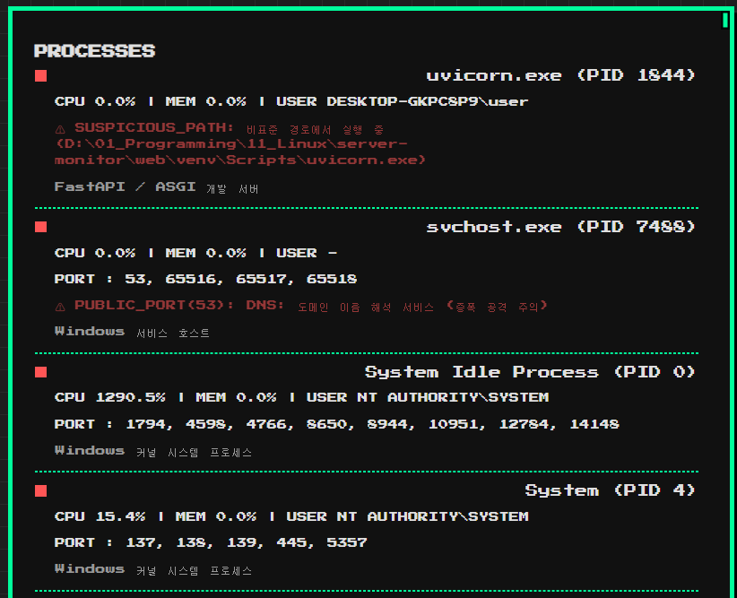
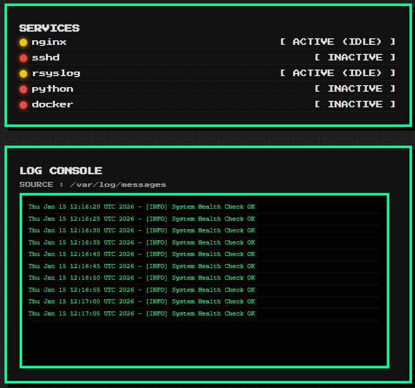
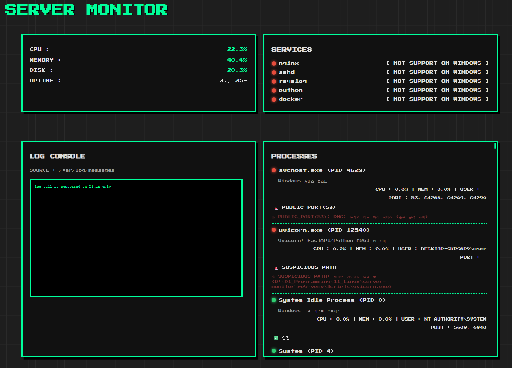

# [서버 관리형 프로젝트] 서버 상태 모니터링 대시보드

## 프로젝트 개요
<b>
서버에서 실행 중인 리소스·서비스·프로세스를 수집하고, <br>
그 상태와 잠재적 위험 요소를 사용자가 이해할 수 있게 웹으로 시각화하는 서버 관리형 프로젝트
</>

<br>

<b>
단순 수치 나열이 아닌 <br>
"이 서버에서 무엇이 실행 중이며, 운영 관점에서 안전한 상태인지"를 설명하는 서버 모니터링 대시보드
</b>

<br>

<b>
Windows 개발 환경과 Linux 운영 환경 간에 근본적인 차이가 존재하는 것을 파악하고, <br>
운영체제별 차이가 서버 모니터링 로직에 어떤 영향을 미치는지 문서가 아닌 직접 구현과 검증을 통해 확인하는 프로젝트
</b>

---
<br>

## 기능
### 1. 시스템 리소스 모니터링
- CPU 사용률
- RAM 사용량
- Disk 사용량
- 서버 구동 시간

### 2. 서비스 상태 확인
| 환경 | 감지 방식 | 상태 출력 예시 | 
| ---------- | ------------- | ---------------- |
| Rocky Linux (Host) | systemctl | active, inactive, failed |
| Docker (Container) | psutil (프로세스 검색) | active, active (idle), failed (zombie) | 
| Window | platform 체크 | not support on Windows |

- 정상: active → 🟢 초록색 도트
- 대기/좀비: idle, zombie → 🟡 노란색 도트
- 중지/에러: inactive, error → 🔴 빨간색 도트

### 3. 로그 모니터링
- Linux 로그 파일 tail (최근 N줄)
- 콘솔 스타일 UI로 표시
- 접근 권한 및 민감 정보 고려

### 4. 프로세스 분석 (확장 핵심 기능)
- 실행 중인 프로세스 목록
- 프로세스별 정보 수집
  - 프로세스명 / PID
  - 실행 경로
  - CPU / 메모리 사용량
  - 실행 사용자
  - 열린 포트
- 위험 요소 자동 판단
  - root/관리자 권한 실행
  - 외부 공개 포트
  - 과도한 메모리 사용
  - 비정상 실행 경로
- 프로세스 역할 설명(Explain)

<br>

## 기술 스택
| 영역         | 기술                            |
| ---------- | ----------------------------- |
| OS         | Rocky Linux 9 / Windows       |
| Backend    | FastAPI                       |
| 시스템 정보     | psutil                        |
| 서비스 상태     | systemctl (Linux)             |
| 템플릿        | Jinja2                        |
| Front UI   | HTML + CSS (Retro / Pixel 콘솔) |
| DB         | MongoDB (확장 예정)              |
| Web Server | Nginx (Reverse Proxy)         |

<br>

## 프로젝트 특징
- psutil 기반 Cross Platform 설계
- Linux 서비스(systemctl)와 로그 직접 연동
- 단순 수치 → 의미 기반 상태 분석
- Retro / Pixel 콘솔 UI로 서버 관리 감성 강화
- FastAPI 기반 가벼운 모니터링 서버 
- 운영 서버 기준 실전 구조

> 이 프로젝트는 단순한 모니터링 도구가 아니라    
> 서버 운영 관점에서 "판단을 돕는 UI"를 목표로 한다.

<br>

## 프로젝트 전체 그림
```
[ 서버 (Window, Rocky Linux) ]
        |
        |  (psutil / systemctl / 로그 / 프로세스)
        v
[ FastAPI 백엔드 ]
        |
        |  JSON / Template
        v
[ 웹 대시보드 (Retro Console UI) ]
        |
        v
[ Nginx Reverse Proxy ]

```

<br>

## 디렉토리 구조
```
server-monitor/
├── docs/            # 설계·정책·네이티브 실행 문서
├── docker/          # Docker 환경 구성 및 운영 기록
├── web/             # FastAPI 웹 애플리케이션
│   ├── app/         # API 엔트리 및 시스템 분석 로직 및 DB 연결
│   ├── requirements.txt
│   └── README.md
├── run-dev.ps1        # Windows 개발
├── run-prod.sh        # Linux 운영
├── .gitignore
└── README.md        # 프로젝트 전체 소개
```

<br>

### FastAPI 서버를 실행할 때마다 가상환경(venv) 실행
```
[ 내 PC 전체 Python ]
        |
        |  (venv 켜기)
        v
[ server-monitor 전용 Python ]
```
- venv를 안 켜면 FastAPI가 존재하지 않음

#### * 실행 루틴
- Windows (개발용)
```bash
# 1. 프로젝트 폴더 이동
cd web

# 2. 가상환경 활성화
venv\Scripts\activate

# 3. 서버 실행 
uvicorn app.main:app --reload

# 3-1. .env 설정 자동 로드
python run.py
```


- Linux / Docker (운영용)
```bash
# 1. 프로젝트 폴더 이동
cd /root/projects/server-monitor/web

# 2. 가상환경 활성화
source venv/bin/activate

# 3. 서버 실행 (외부 접속 허용)
uvicorn app.main:app --host 0.0.0.0 --port 8000

# 백그라운드 실행 (추후 pm2로 변경)
nohup uvicorn app.main:app --host 0.0.0.0 --port 8000 > server.log 2>&1 &
```

#### 실행 방법

```
# Windows (개발)
.\run-dev.ps1

# Linux (운영)
./run-prod.sh
```

---
<br>

## 기능 범위 

### ✅ 1차 목표 :상태 시각화 (완료) 
- CPU 사용률
- RAM 사용량
- Disk 사용량
- 서버 구동 시간
- 주요 서비스 상태
- 로그 tail (최근 10줄)
- 기본 대시보드 (Retro / Pixel Server Console)

<br>


> Windows 개발 환경에서 1차 목표 기능을 구현한 화면

<br>

### ✅ 2차 목표 : 위험 판단 (완료)
- 프로세스 위험 분석
- 포트 기반 보안 경고
- Docker 컨테이너 인식
  
<br>


> Windows 개발 환경에서 프로세스 위험 분석을 구현한 화면

<br>


> docker (rocky linux container) 개발 환경에서 서비스 상태, 로그 tail을 구현한 화면

<br>


> 디자인 확정

### ✅ 3차 목표 : 행동 제안
- DB 연동 (프로세스 판단 기준 / 정책 관리용)
- 프로세스 종료 (권장 종료 대상만 추려서 제안)

### 🔜 추가 확장 목표
- 다중 서버 관리
- Slack / Telegram 알림
- Prometheus 연계
- 
---

<br>

## 개발 순서

1. 프로젝트 구조 / README / 컨셉 정리 ✅
2. Windows 개발 환경에서 기능 구현 (1차) ✅
   - process.py 설계 (Windows / Linux 분기 기준)
   - 경고 판단 로직을 순수 함수로 분리
3. UI 작업 (프로세스 시각화) ✅
4. Git 저장소 반영 (push) ✅
5. Docker 기반 Rocky Linux 환경 적용 (Linux 이식 단계) ✅
6. OS 차이로 인해 동작이 깨지는 지점 식별 및 수정 ✅
7. mongoDB 연동 (2차) ✅
8. 프로세스 종료 기능 (2차) ✅
9. 위험 알림 메일링 서비스 (3차) 
10. 프로세스 추가 form (3차) 
    - 사용자에게 이름만 받기
    - 중복이 많으면 (cnt) 조사 후 등록
11. 관리자 페이지
12. 실제 Rocky Linux (VirtualBox) 운영 환경 적용 및 네이티브 기준 최종 검증