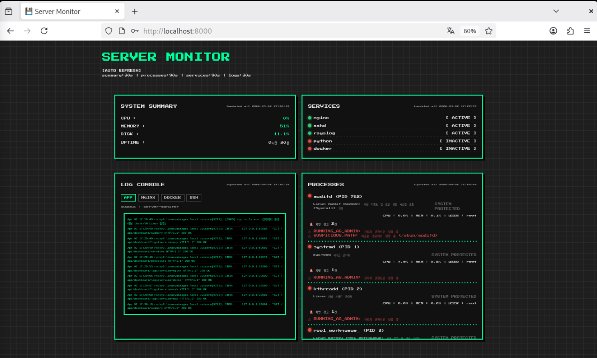
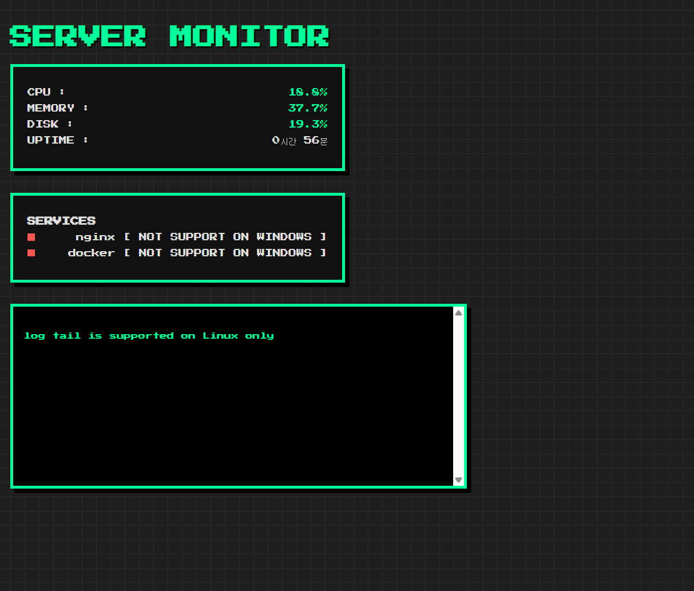
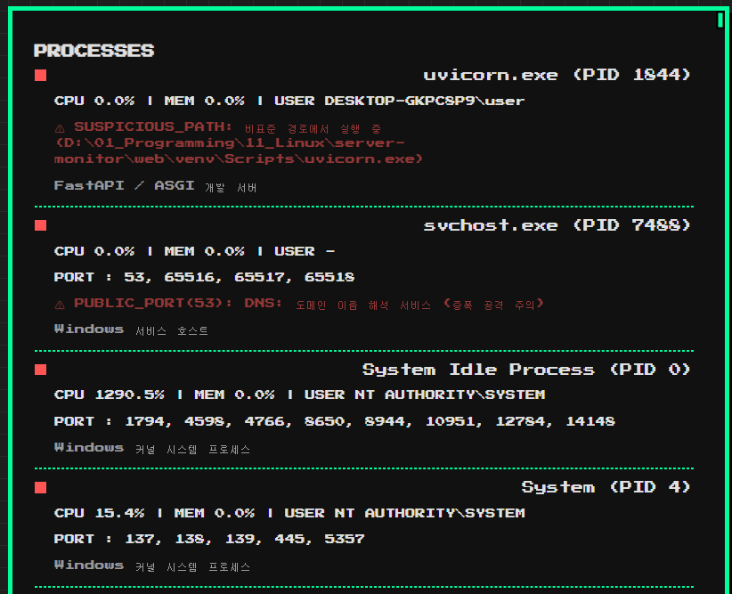
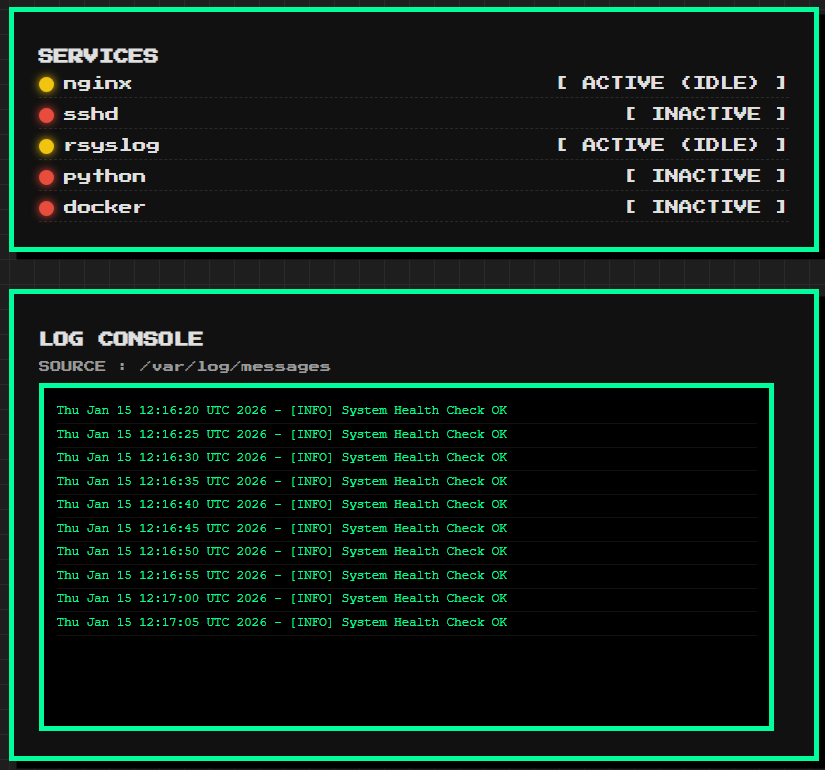
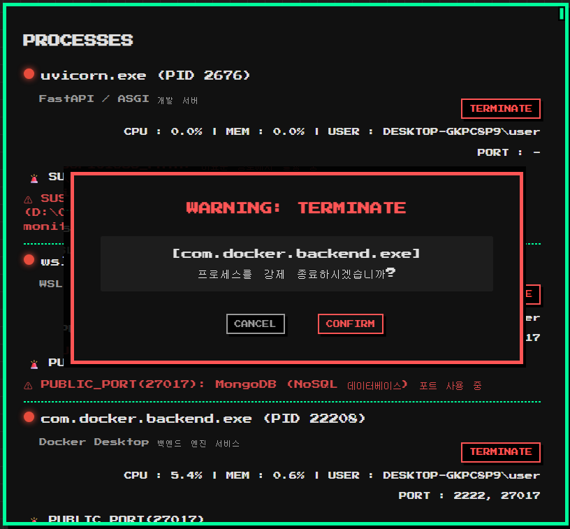

# [서버 관리형 프로젝트] 서버 상태 모니터링 대시보드

#### Rocky Linux Native + systemd + Ansible 기반 서버 상태 모니터링 시스템

<br>


> Rocky Linux (VirtualBox) 운영 환경 적용 및 네이티브 기준 최종 검증 화면

---
<br>

## 📑 목차

- [프로젝트 개요](#프로젝트-개요)
- [기능](#기능)
- [기술 스택](#기술-스택)
- [프로젝트 특징](#프로젝트-특징)
- [프로젝트 전체 그림](#프로젝트-전체-그림)
- [디렉토리 구조](#디렉토리-구조)
- [운영 자동화 (Ansible)](#운영-자동화-ansible)
- [기능 범위](#기능-범위)
- [개발 순서](#개발-순서)
- [이 문서의 범위](#이-문서의-범위)
  
---
<br>

## 프로젝트 개요

1. 서버에서 실행 중인 리소스·서비스·프로세스를 수집하고,   
그 상태와 잠재적 위험 요소를 **운영 관점에서 이해 가능하게 시각화**하는 서버 관리형 프로젝트

<br>

2. 단순 수치 나열이 아니라 "이 서버에서 무엇이 실행 중이며, 지금 안전한 상태인가"를   
 설명하는 모니터링 대시보드

<br>

3. Windows 개발 환경과 Linux 운영 환경의 구조적 차이를   
**직접 구현·검증을 통해 확인**하는 것을 목표로 하는 프로젝트

---
<br>

## 기능
### 1. 시스템 리소스 모니터링
- CPU 사용률
- RAM 사용량
- Disk 사용량
- 서버 구동 시간

### 2. 서비스 상태 확인
| 환경 | 감지 방식 | 상태 출력 예시 | 
| ---------- | ------------- | ---------------- |
| Rocky Linux (Host) | systemctl | active, inactive, failed |
| Docker (Container) | psutil (프로세스 검색) | active, active (idle), failed (zombie) | 
| Windows | platform 체크 | not supported on Windows |

- 정상: active → 🟢 초록색 도트
- 대기/좀비: idle, zombie → 🟡 노란색 도트
- 중지/에러: inactive, error → 🔴 빨간색 도트

### 3. 로그 모니터링
- Linux 로그 파일 tail (최근 N줄)
- 콘솔 스타일 UI로 표시
- 접근 권한 및 민감 정보 고려

### 4. 프로세스 분석 (운영·보안 핵심 기능)
- 실행 중인 프로세스 목록
- 프로세스별 정보 수집
  - 프로세스명 / PID
  - 실행 경로
  - CPU / 메모리 사용량
  - 실행 사용자
  - 열린 포트
- 위험 요소 자동 판단 및 상태 분류
  - root/관리자 권한 실행
  - 주요 공개 포트 및 시스템 포트 사용
  - 과도한 메모리 사용
  - 비정상 실행 경로
  - KNOWN_PROCESSES 기반 설명(Explain) 및 미등록 프로세스 식별
- 프로세스 역할 설명(Explain)

<br>

## 기술 스택

| 영역         | 기술                          |
| ---------- | ------------------------------ |
| OS         | Rocky Linux 9 / Windows        |
| Backend    | FastAPI                        |
| 시스템 정보  | psutil                      |
| 서비스 상태  | systemctl (Linux)           |
| 템플릿      | Jinja2                       |
| Front UI   | HTML + CSS (Retro / Pixel 콘솔) |
| DB         | MongoDB                       |
| Web Server | Nginx (Reverse Proxy)         |
| 운영 자동화 | Ansible                       |

<br>

## 프로젝트 특징

- psutil 기반 Cross Platform 설계
- Linux 서비스(systemctl)와 로그 직접 연동
- 단순 수치 → 의미 기반 상태 분석
- Retro / Pixel 콘솔 UI로 서버 관리 감성 강화
- FastAPI 기반 가벼운 모니터링 서버 
- Ansible 기반 운영 환경 재현 및 자동 구성
- Vault 기반 민감 정보 분리 관리
- 운영 서버 기준 실전 구조

> 이 프로젝트는 단순한 모니터링 도구가 아니라    
> 서버 운영 관점에서 "판단을 돕는 UI"를 목표로 한다.

<br>

## 프로젝트 전체 그림

```
[ 서버 (Windows, Rocky Linux) ]
        |
        |  (psutil / systemctl / 로그 / 프로세스)
        v
[ FastAPI 백엔드 ]
        |
        |  JSON / Template
        v
[ 웹 대시보드 (Retro Console UI) ]
        |
        v
[ Nginx Reverse Proxy ]

```

<br>

## 디렉토리 구조

```
server-monitor/
├── docs/            # 설계·정책·네이티브 실행 문서
├── docker/          # Docker 환경 구성 및 운영 기록 (중간 검증 단계, 현재 미사용)
├── web/             # FastAPI 웹 애플리케이션
│   ├── app/         # API 엔트리 및 시스템 분석 로직 및 DB 연결
│   ├── requirements.txt
│   └── README.md
├── infra/           # 운영 자동화
│   └── ansible/
│ 
├── run-dev.ps1        # Windows 개발
├── run-prod.sh        # Linux / Docker (이식 검증 / 임시 실행)
├── .gitignore
└── README.md        # 프로젝트 전체 소개
```

### 문서 역할 분리

- README.md : 프로젝트 전체 개요
- docs/ANSIBLE_INFRA.md : 운영 환경 자동화
- docs/FASTAPI_DEV.md : FastAPI 설계
- docs/NATIVE_RUN.md : Linux Native 실행 검증
- docs/POLICY.md : 프로세스 보안 정책
- web/README.md : 웹 애플리케이션 구조

<br>

### Python 가상환경(venv) 사용 정책

- 개발 환경(Windows)에서는 개발 편의를 위해 가상환경을 수동으로 활성화하여 서버를 실행한다.
- 운영 환경(Linux)에서는 가상환경을 직접 활성화하지 않으며,   
  systemd 서비스에서 venv 경로의 python/uvicorn을 직접 사용한다.
- 운영 환경의 서버 실행 및 등록은 Ansible을 통해 자동화 진행한다.

```
[ 내 PC 전체 Python ]
        |
        |  (venv 켜기)
        v
[ server-monitor 전용 Python ]
```
- venv를 안 켜면 FastAPI가 존재하지 않음

### * 실행 루틴

- Windows (개발용)
```bash
# 1. 프로젝트 폴더 이동
cd web

# 2. 가상환경 활성화
venv\Scripts\activate

# 3. 서버 실행 
uvicorn app.main:app --reload
```

#### 4. 브라우저 확인 (http://127.0.0.1:8000/)


- Linux / Docker (이식 검증 / 임시 실행)
```bash
# 1. 프로젝트 폴더 이동
cd /root/projects/server-monitor/web

# 2. 가상환경 활성화
source venv/bin/activate

# 3. 서버 실행 (외부 접속 허용)
uvicorn app.main:app --host 0.0.0.0 --port 8000

# 백그라운드 실행
nohup uvicorn app.main:app --host 0.0.0.0 --port 8000 > server.log 2>&1 &
```

> ※ 본 실행 방식은 이식 검증 및 초기 테스트용이며,   
> 실제 운영 환경에서는 Ansible + systemd 서비스로 실행한다.

---
<br>

## 운영 자동화 (Ansible)

> 서비스 배포 도구가 아니라 **운영 환경 재현 도구**로 사용

### Rocky Linux 기준

1. 필수 패키지 설치
   - python3, pip, firewalld
   - Docker 계열은 별도 playbook에서 관리
2. 유저 / 권한
   - 운영 계정 생성
   - sudo 권한
   - SSH 키 배포
3. 보안 기본값
   - 방화벽 포트 허용 (22, 80, 443 등)
   - root SSH 로그인 차단
   - 타임존, 로케일, NTP

> “서버 1대 재설치 → 동일 상태 복구”가 목적일 때 가장 가치 있음

### Ansible의 역할
1. Python / venv 준비
2. 애플리케이션 실행 환경 구성
3. 환경 변수 및 실행 설정 배치
4. MongoDB 인증 활성화 및 계정 구성
5. systemd 서비스 등록
6. 서비스 자동 시작 기반 구성

#### Ansible이 관여하면 안 되는 영역
  
| 영역            | 이유           |
| ------------- | ------------ |
| FastAPI 내부 로직 | 앱 책임         |
| psutil 분석     | 코드 책임        |
| 위험 판단 기준      | MongoDB + 로직 |
| UI / 템플릿      | 프론트 책임       |


### 서버 기준 디렉토리 배치
```
/home/rockylinux/
└── server-monitor/           ← Git 레포 전체 clone
    ├── docs/
    ├── docker/
    ├── web/
    │   └── app/              ← 실제 FastAPI 코드 원본
    ├── infra/
    │   └── ansible/
    └── README.md
```

### 운영 대상은 별도
```
/opt/server-monitor/
├── app/        ← Ansible이 web/app을 배치
├── venv/
├── logs/
├── data/
└── scripts/
```

### Ansible이 수행할 핵심 작업 흐름
1. Git Clone: 운영 서버의 /home/rockylinux/server-monitor/ 경로로 코드 다운로드
2. 운영 디렉토리 세팅: 구동 전용 디렉토리인 /opt/server-monitor/를 만들고, Git에서 다운받은 web/app/을 복사
3. Python 환경 구성: /opt/server-monitor/venv/를 만들고 requirements.txt에 있는 패키지 설치
4. Systemd 등록: FastAPI 앱이 운영 서버에서 서비스 형태로 구동될 수 있도록 systemd 유닛을 배치하고 자동 시작 기반을 구성

---
<br>

## 기능 범위 

### ✅ 1차 목표 :상태 시각화 (완료) 
- CPU 사용률
- RAM 사용량
- Disk 사용량
- 서버 구동 시간
- 주요 서비스 상태
- 로그 tail (최근 10줄)
- 기본 대시보드 (Retro / Pixel Server Console)

<br>


> Windows 개발 환경에서 1차 목표 기능을 구현한 화면

<br>

### ✅ 2차 목표 : 위험 판단 (완료)
- 프로세스 위험 분석
- 포트 기반 보안 경고
- Docker 컨테이너 인식
  
<br>


> Windows 개발 환경에서 프로세스 위험 분석을 구현한 화면

<br>


> docker (rocky linux container) 개발 환경에서 서비스 상태, 로그 tail을 구현한 화면


### ✅ 3차 목표 : 행동 제안 (완료)
- MongoDB 연동 (프로세스 판단 기준 저장)
- 종료 가능 프로세스 식별 및 종료 기능 제공
  
<br>


> 프로세스 종료 기능을 구현한 화면

### 🔜 추가 확장 목표
- 다중 서버 관리
- 위험 이벤트 기반 Email 알림
- 종료 사유 / 권장 조치 메시지 세분화
- 프로세스 등록 요청 Form (사용자 입력 기반 등록 요청 / 중복 빈도(cnt) 기반 자동 분류)
- 관리용 페이지 (프로세스 등록 보조 기능)
- 운영자 권한 분리 (Viewer / Operator / Admin)

---

<br>

## 개발 순서

1. 프로젝트 구조 / README / 컨셉 정리 ✅
2. Windows 개발 환경에서 기능 구현 ✅
   - process.py 설계 (Windows / Linux 분기 기준 수립)
   - 경고 판단 로직을 순수 함수로 분리
3. UI 작업 (프로세스 시각화) ✅
4. Git 저장소 반영 (push) ✅
5. Docker 기반 Rocky Linux 환경 적용 (Linux 이식 단계) ✅
6. OS 차이로 인해 동작이 깨지는 지점 식별 및 수정 ✅
7. mongoDB 연동 ✅
8. 프로세스 종료 기능 ✅
9. 인증/인가 부재 문제 해결 ✅
10. Ansible을 통한 운영 환경 자동 구성 및 재현성 확보 ✅
11. MongoDB 인증 활성화 및 Ansible Vault 기반 비밀값 분리 적용 ✅
12. 실제 Rocky Linux (VirtualBox) 운영 환경 적용 및 네이티브 기준 최종 검증 ✅

---
<br>

## 이 문서의 범위

- 프로젝트 전체 개요 및 목표 설명
- 기능 구성과 기술 스택 요약
- 문서 및 디렉토리 역할 안내
- 개발·운영 흐름의 큰 그림 제시

> ※ FastAPI 애플리케이션 설계: docs/FASTAPI_DEV.md 참조  
> ※ Linux Native 실행 검증: docs/NATIVE_RUN.md 참조  
> ※ 운영 환경 자동화 기준: docs/ANSIBLE_INFRA.md 참조  
> ※ 프로세스 보안 정책: docs/POLICY.md 참조  
> ※ 웹 애플리케이션 구조 및 구현 상세: web/README.md 참조  
> ※ 인프라 디렉토리 구성 및 자동화 구조: infra/README.md 참조

---
